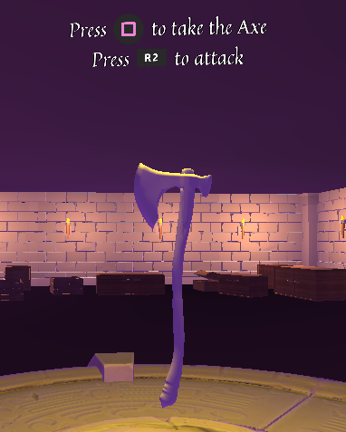

# Proyecto final: Limbo - Raise to Heaven
## Asignatura: Interfaces Inteligentes

## Autores: 
* [Marta Julia González Padrón](mailto:alu0101254487@ull.edu.es)
* [Adal Díaz Fariña](mailto:alu0101112251@ull.edu.es)
* [Vanessa Valentina Villalba Pérez](mailto:alu0101265704@ull.edu.es)

## Tabla de contenidos
  - [APK del prototipo](#apk-del-prototipo)
  - [Carpeta con contenidos](#carpeta-con-contenidos)
  - [Funcionamiento del prototipo](#funcionamiento-del-prototipo)
  - [Implementación práctica](#implementación-práctica)
  - [Interfaz Multimodal](#interfaz-multimodal)
  - [IA enemiga](#ia-enemiga)
  - [Sistema de vida y Checkpoint](#sistema-de-vida-y-checkpoint)
  - [Interfaz de Usuario](#interfaz-de-usuario)
  - [Habilidad](#habilidad)
  - [Coger objetos](#coger-objetos)
  - [Controles](#controles)
  - [Acta de acuerdos del grupo](#acta-de-acuerdos-del-grupo)
  - [Objetivo](#objetivo)
  - [Escenas](#escenas)
  - [Maquetación de escenas](#maquetación-de-escenas)
  - [Problemas encontrados y sus soluciones](#problemas-encontrados-y-sus-soluciones)
  - [Demo de ejecución](#demo-de-ejecución)

## Presentación
* [Enlace a las diapositivas](https://www.canva.com/design/DAE3iapWzcg/xVX3AsjMeUCmsPNeyCfsmg/view?utm_content=DAE3iapWzcg&utm_campaign=designshare&utm_medium=link&utm_source=sharebutton)
  
## APK del prototipo
* [Enlace de descarga](https://drive.google.com/file/d/1-XqJnTJjw_UeHNsAB6knFjI0iSLYKh67/view?usp=sharing)

## Carpeta con contenidos
* [Carpeta de Google  Drive](https://drive.google.com/drive/folders/1NBZegeNUa-f89tKr0pNglLsoqENmG-jV?usp=sharing)

## Funcionamiento del prototipo
El jugador acaba de morir y se despierta desorientado, lo que acaba de descubrir es que debe de luchar para poder "ascender" al mundo de los cielos en paz. Para lograr esto se ha dividido el juego en diferentes niveles los cuales representan al infierno, al limbo y al cielo respectivamente.

* **Nivel 1**: Una vez despierto el jugador deberá recorrer un bosque encantado que esconde secretos. Al recorrerlo se encuentra una villa abandonada con una carta que explica los pasos a seguir, a continuación deberá entrar en una mazmorra repleta de trampas para poder alcanzar el arma que le ayudará a derrotar al jefe final y así, pasar al siguiente nivel.
* **Nivel 2**: El silencio es clave, el jugador se encuentra en el limbo y si sube el tono de su voz  se verá acorralado por las llamas avivadas del fuego. Las zonas de fuego son irreconocibles, por lo que debe ir con mayor precaución hasta alcanzar un portal al final del todo que le lleve al siguiente nivel.
* **Nivel 3**: Finalmente, el jugador ha llegado al cielo pero antes de ascender deberá sobrepasar una última penitencia, atravesar las nubes. Pero lograrlo no será una tarea fácil ya que deberá ir esquivando los obstáculos hasta finalmente llegar a la luz que le permitirá irse en paz.

## Implementación práctica

Para la implementación del prototipo, se llevaron a cabo diferentes tareas, sin embargo, las más destacadas son las siguientes:

### Interfaz Multimodal
Se ha implementado un sistema capaz de reconocer la cantidad de decibelios en los que se encuentra hablando actualmente el jugador, en clips de audio de 2 segundos que se van generando automáticamente. Para lograrlo se ha hecho uso de la clase ```Microphone``` y el cálculo de los decibelios reconocidos para cada clip. 

A su vez para poder indicarle al jugador a cuantos decibelios se encuentra hablando, en el canvas de la escena se muestra una barra que aumenta o disminuye según sea el caso. Se ha considerado una cantidad mínima y máxima, la cual en nuestro caso, se ha estimado tomando en cuenta la sensibilidad del móvil utilizado, ya que estos parámetros no son iguales para todos los dispositivos, de acuerdo a pruebas que nosotros mismos realizamos durante la implementación con diferentes micrófonos.

Finalmente, en caso de que el jugador hable en un tono de voz elevado, la intensidad que hace referencia a la luz y la escala de las partículas utilizadas para la representación del fuego aumentan, por lo que el jugador se encontrará en una escena más compleja de atravesar ya que el fuego le disminuye un punto de vida.

### IA enemiga

La animación de la IA enemiga, se hizo a través del modelo 3D del enemigo. Se descargó el modelo 3D y las animaciones correspondientes y con el animator según la acción que hace la IA se anima. La IA tiene tres tareas: patrullar, perseguir al enemigo y atacar al enemigo. Al diseñar la logica de la misma, se definieron dos áreas, el área para patrullar y el área de ataque al enemigo que se encuentra dentro de esta primera. Cuando el jugador entra en el área de patrullaje el enemigo persigue al jugador hasta que este se encuentre en el área de ataque. Para poder definir la lógica de patrullaje lo que se hace es que se genera un punto aleatorio en un rango determinado del mesh y la IA se dirige hacia él. En vez de definir una ruta predefinida creamos una ruta aleatoria por el nav mesh. Luego para perseguir al jugador lo que se hace es que gracias a que la IA tiene el componente de mesh agent se le puede definir un destino a ese agente que en este caso es la posición del jugado. Una vez entra en el rango de atacar el jugador modificamos la posición de destino del agente para que sea la actual y empieza el código del ataque. En este caso es un proyectil. Se define el proyectil y si aplica una serie de fuerzas. Luego, para el proyectil lo que hicimos fue modificar la posición para que se lance desde la posición de la mano según la animación. Es decir, el evento del ataque ocurre cuando llegar a un determinado segundo dentro de la animación y entonces se calcula esa posición de la palma de la mano en ese momento concreto. 

### Sistema de vida y Checkpoint 

El sistema de vida se ha implementado a lo largo de todos los niveles. El jugador tiene 5 vidas y cada vez que colisiona con un obstáculo o es golpeado por un enemigo se le resta vida. Cuando el usuario pierde todas las vidas, se muere pero... ¿Qué pasa entonces? Se ha implementado un sistema de respawn o reaparición con puntos de control o también llamados checkpoints. Lo que hacemos es almacenar la posición que tiene el usuario al comenzar la escena y cuando muere es trasladado a esa posición. Además también hemos contemplado la existencia de puntos de control para que cuando el usuario pueda guardar su nuevo punto de partida en caso de muerte al reaparecer. Para que todas estas funcionalidades no se vean de manera brusca durante la partida, se ha implementado un controlador para la *interfaz de usuario*. Es importante destacar el uso de las corrutinas para mejorar la eficiencia del juego y poder atrasar la ejecución de otros apartados del código.

### Interfaz de Usuario

Para que toda la información sea mostrada al usuario de manera que la entienda hemos creado diferentes objetos *Canvas* para ello. Por una parte tenemos la cinemática en la introducción para que el usuario entienda el contexto al igual que una pequeña cinemática al concluir para volver al menú principal. Después dentro de cada nivel tenemos un Canvas que muestra la vida actual del jugador asi como los destellos rojos cuando es herido y las transiciones desde y hacia negro para que los cambios de escenas y de posiciones sean mas fluidos. Además dentro de los niveles ha sido necesario añadirle instrucciones al usuario como en el nivel 2 indicarle que abra la puerta con el *cuadrado*. En el nivel 1 se le indica que coja lea la carta (que también fué creada con otro Canvas) y coja el arma con el mismo *cuadrado* y que utilice el arma usando el botón *R2*.




### Habilidad

La habilidad del jugador, es lanzar el hacha que a una determinada distancia máxima o cuando el jugador lo decide regresa a él. Tiene dos funciones una es lanzar el hacha y la otra es que regrese. Al lanzar el hacha básicamente lo que hace es aplicarle dos fuerzas, una de impulso y otra de torque. La verdadera mágica está a la hora de hacer regresar la hacha. Gracias a la fórmula de la curva cuadrática de Bezier, podemos hacer regresar al hacha siguiendo una trayectoria curva. Los tres puntos que usamos son: La posición de la zona de interación que es de donde lanzamos el hacha, la zona final donde decidimos que regrese el hacha y un punto que definimos al lado de la zona de interación un poco más adelante. Siguiendo esta fórmula para tres puntos 


vamos calculando los puntos en cada instante hasta que el hacha regresa. Lo que hace al regresar es ir a la posición de estos puntos.

### Coger objetos

Lo que se hace es que cuando el objeto que se quiere coger es válido almacena en una variable ese objeto mientras lo este apuntado con el puntero. Cuando dejamos de mirar al objeto con el puntero se nos pone a null. A la hora de tocar el botón si el objeto no es nulo pues podemos cogerlo. Esto nos obliga a mirar un objeto si queremos cogerlo. Para cogerlo básicamente lo que hacemos es transformar la posición del objeto a la posición de la zona de interación y lo convertimos en hijo de la misma. Al convertirlo en hijo de la misma del objeto se mueve acompañando al padre por lo da la sensación que lo llevamos con nosotros. A su vez la zona de interación es hija de la camará para que el objeto siempre nos sea vicible cuando lo cogemos. A la hora de soltarlo solo tenemos que cumplir la condición de que lo hayamos cogido primero.

### Controles
En nuestro caso, se ha utilizado para hacer las pruebas un mando para la PS4, sin embargo, para evitar conflictos en caso de que se utilice un mando de la XBOX, se ha utilizado la clase ```Gamepad``` pero con la indicación de los diferentes controles de forma genérica para que pueda ser reconocida por el Input System correctamente y no tener problemas de mapeo con los diferentes botones.

* Para que pueda moverse a lo largo de la escena, tiene que usar el ```leftStick``` y en caso de correr, el ```leftTrigger``` o ```botón de L2```.
* Para que el jugador pueda saltar, tiene que pulsar el ```buttonSouth``` o ```botón de la X```.
* Para la interacción en la escena, tiene que pulsar el ```buttonWest``` o ```botón del cuadrado```. Las acciones disponibles son: Coger el arma, abrir la carta y apertura de puertas (siempre que el jugador se encuentre lo suficientemente cerca de la misma).
* Para que el jugador pueda lanzar el arma, tiene que usar el ```rightTrigger``` o ```botón de R2```.


## Acta de acuerdos del grupo

### Objetivo

Juego por niveles. El usuario tiene que pasar una serie de niveles para poder completar el juego.

### Escenas

| Escena      | Asignado a |
| ----------- | -----------|
| Menu        | Adal       |
| Intro       | Marta      |
| Nivel 1     | Adal       |
| Nivel 2     | Vanessa    |
| Nivel 3     | Marta      |
| Outro       | Marta      |

Para una implementación más rápida y asíncrona, decidimos repartirnos los niveles del juego. Por otro lado, cuestiones como la unificación de las diferentes escenas, la aplicación de RV con cardboards y la ambientación del juego fue realizada en conjunto, así como la lluvia de ideas que nos permitió orientar y diseñar la idea de cada nivel para lograr el producto final. Muchas veces a los largo del desarrollo hicimos uso de técnicas de pair programming para ayudarnos entre nosotros y así superar las dificultades de los niveles y problemas encontrados.

### Maquetación de escenas

```Nivel 1```

El nivel 1 resultó muy complejo al momento de implementar el diseño del nivel. Uno de los puntos a destacar en la maquetación de la escena es el gran número de assets utilizados. Esta escena, se divide en tres partes fundamentales: la primera es la zona de bosque, la segunda es la mazmorra y la tercera en la zona del jefe final. 

* **La zona del bosque**, es la zona inicial de la escena donde ocurre el primer evento que ubica al jugador en la escena y para el diseño planteado se aprovechó el prefab de pago de la naturaleza. El jugador llega al primer nivel sin saber que hacer y empieza a explorar la escena. El bosque se construyó añadiendo prefabs uno a uno, para no sobrecargar la zona inicial y que el jugador se puediera mover con facilidad. Además, se modificaron las texturas para darle un tono rojo y amarillo, con un leve tono violeta en el cielo. Un elemento a destacar en la zona inicial es el santuario, en el que hubo que modificar prefabs, añadir efectos de iluminación, añadir partículas, etc.

* **La mazmorra**, es una de las zonas más grandes del mapa. Lo primero que se hizo fue diseñar a papel como iba a ser la mazmorra


Una vez diseñada a papel, con la herramienta de probuilder de unity se hizo el modelo 3D de cada habitación de la mazmorra. El trabajo real del diseño del modelo 3D de la mazmorra estuvo a la hora de crear las puertas en el modelo, enlazar cada conexión para que no hubiera huecos en el modelo, etc.


Una vez que disponíamos del modelo 3D de la mazmorra, la decoramos por dentro con diferentes prefabs: paredes, un suelo, un techo, antorchas modificadas para que tuvieran efectos de luz, decoración interior, etc. No pudimos usar los prefabs directamente sino que, hubo que crear el modelo 3D primero porque sino entraba la luz de la direction light de la escena. 

Una vez decorada la escena, se añadieron las trampas. Hubo que crear nuevas animaciones para las trampas debido a que eran muy rápidas o muy limitadas. Además se modificaron los prefabs para añadirle collider y que detectaran colisiones.

* **Zona del jefe final**, en la zona del jefe final gracias a la herramienta del terreno "paint tree" se limita la visión del usuario. En esta zona hubo que crear un nav mesh para que la IA se moviera por la zona.  

```Nivel 2```

El objetivo del nivel 2 fue representar al limbo, por lo que se decidió optar por una escena que fuera más "clínica" y "cuadrada" a la vista. La escena está dispuesta en una especie de nave o plataforma que cuenta con dos plantas, que se pudo realizar con la ayuda de un prefab para naves espaciales, aunque la distribución de los pasillos y detalles tuvo que hacerse manualmente, así como modificaciones en el tamaño de los distintos elementos. 

La primera planta es donde aparece el jugador a penas llega al nivel y tiene unas escaleras que le permiten subir a la siguiente planta y si se acerca lo suficientementea las ventanas se puede visualizar el skybox elegido, que representa un cielo denso de color negro colocado en forma de espejo, para que diera la impresión de que no existe un suelo donde los pasillos puedan apoyarse.

Por otro lado, se ha implementado una acción con las puertas de la escena en la que el jugador debe estar lo suficientemente cerca y a su vez haber pulsado el botón cuadrado para que puedan abrirse, con el uso de eventos para que adicionalmente se abriera una puerta a la vez, diferenciadas cada una de ellas por su ID.

Para el fuego se han echo modificaciones a un prefab que disponía de diferentes formas de fuego, pero se han modificado para que pueda hacer daño al jugador al añadir colliders y a su vez poder ajustar la intensidad y escala de las zonas de fuego de acuerdo al tono de voz que tenga el jugador durante la partida, a partir de un controlador de fuego. Lo interesante de las zonas de fuego es que solamente se activan una vez el jugador ha sobrepasado algunas zonas en los pasillos, por lo que existe un factor sorpresa y debe tener cuidado ya que sino resta vida.

```Nivel 3```

Este nivel representa casi el final de la odisea donde el cielo puede parecer estar cerca aunque un mínimo desliz nos lleva a la muerte. En esta escena hay que superar una serie plataformas con características para realmente llegar al cielo. Hay nubes con propiedades de colchoneta saltarina otras que se mueven para arriba y abajo y otras que se mueven para los lados. En medio hay una plataforma de rocas flotantes con un punto de control ya que la dificultad de este nivel es mas elevada. Tras superar otra serie de nubes e incluso una bola de demolición, el usuario llega a la luz final y pasa a la cinemática donde se le indica que ha ganado, se le dice una moraleja y salen los créditos finales.

## Problemas encontrados y sus soluciones

* **Interfaz multimodal**: En un primer lugar se tenía como objetivo implementar los conocimientos adquiridos en la práctica de keyword y dictation recognition, sin embargo, nos encontramos con el problema de que a pesar que en el ordenador funcionara, no era posible realizar un build para Android. 
  
  Decidimos buscar una solución al mismo y como alternativa encontramos que se podría implementar por nuestra parte un plugin en Java para poder acceder a la clase ```SpeechRecognizer``` perteneciente a Android, pero la curva de aprendizaje y complejidad del proyecto aumentaba considerablemente, por lo que decidimos optar por algo diferente.

  Finalmente, decidimos hacer uso de la clase ```Microphone``` del UnityEngine.AudioModule, para poder recoger clips de audio procedentes del micrófono del jugador en un rango de 2 segundos continuamente y, calcular los decibelios del mismo, para que de esta forma en caso de que suba el tono de la voz, la intensidad de la luz del fuego y la escala de las partículas aumente.

* **Nav Mesh**: A la hora de crear un nav mesh para que la IA enemiga pudiera recorrer el mapa, hubieron una serie de problemas. Al principio la zona del jefe final tenia una plataforma que era un modelo 3D complejo. Al calcular el nav mesh del modelo habían partes que no las calculaba bien Unity y había que ajustarlas manualmente. El caso era que aun al ajustarla había zona donde el enemigo no podía interactuar por lo que rompia la jugabilidad en el combate contra el jefe final. Al final la solución fue eliminar el modelo 3D complejo y utilizar un sub modelo dentro del modelo 3D definiendolo como un obstáculo del mesh nav. Así no perdiamos ni jugabilidad, ni estropeabamos el diseño.

* **Throw Axe**: El hacha cuando se lanza a la hora de volver utiliza la fórmula de la curva cuadrática de Bézier para recrear a la zona de interacción donde esta la mano esperando. Uno de los problemas es que la zona de interacción se desplaza a la hora de mover el usuario por lo que a la hora de volver no siempre regresaba a la misma posición, existía un margen de error. Además al principio cuando el usuario se movía el hacha no regresaba ni si quiera en algunas ocasiones. Soluciones: Para que regresará nos dimos cuenta que al detectar una colisión pierde la fuerza que se le ejercia sobre el hacha por lo que añadimos la opción de que no solo regrese cuando cumpla la distancia máxima, sino que al presionar de nuevo el botón regrese inmediatamente. La solución para la zona de interación fue añadir la mano al prefab de la Hacha. Como el margen de error no se podía despreciar para que fuera exacto quitamos la mano del jugador y la añadimos al hacha y lo que hicimos fue desaparecerla cuando se lanza el hacha. Así siempre da el efecto de que el hacha regresa a la mano.

* **IA enemiga**: A la hora de atacar tuvimos que sacrificar el diseño del proyectil de la IA en pros de aumentar el acierto. Al principio la IA tenia unas fuerza definidas para lanzar el proyectil pero eran inexactas cuando el jugador se movía, por lo que hubo que modificarlas. Las nuevas fuerzas utilizan el calculo de la distancia con el jugador, pero se le aplica una fuerza mucho mayor por lo que el efecto de particulas del proyectil se ve afectado.  

* **First Person Character Controller**: Para poder ver la perspectiva del personaje en primera persona, nos hemos aprovechado del *First Person Character Controller* del paquete *Starter Assests*. No obstante, nos dió muchos problemas, sobretodo para implementar el nivel 3 ya que el objeto como tal no tiene un componente *Rigidbody* pero si lo simula. Es por ello que en ocasiones no terminan de cuajar algunas funcionalidades. Para solverntar esto tuvimos que entender todo este controlador e incluso añadir y modificar funciones para que se adaptara a nuestras necesidades. Entre ellas modificamos la función de movimiento y tuvimos que crear una nueva para poder crear nubes "saltarinas" que manipulara la capacidad de salto. Tambien una funcionalidad para que cuando el jugador fuese atacado se impulsara un poco para atrás.

* **Realidad virtual**: A la hora de implementar la realidad virtual decidimos seguir los pasos aplicados durante la práctica realizada en el horario de clases, pero nos encontramos que con esa configuración habían fallos. Principalmente con el reticle pointer ya que al activar el debug rays nos dimos cuenta que efectivamente estaba generando rayos coherentes pero a la hora de realizar alguna acción con el OnPointerEnter, era incapaz de reconocer el objeto al que le habíamos asignado el collider, el puntero nisiquiera cambiaba de tamaño. 

Por lo que decidimos realizar algunas pruebas y nos encontramos con que no era necesario añadir en nuestro caso el GvrEditorEmulator, ni el GvrControllerMain para que pudiera funcionar correctamente ya no solo en el editor de Unity en el ordenador sino que también al momento de hacer el build para Android. 

Adicionalmente, debido a la longitud del juego decidimos desactivar el reconocimiento del movimiento de la cabeza, ya que también utilizamos un mando, consideramos que la interacción con el juego es más sencilla e intuitiva de esta manera.

* **Canvas**: El mayor problema que nos dió el Canvas fue al conseguir al fin unas gafas de realidad virtual y querer probar nuestro juego, que ningun canvas se veía porque el modo de renderizado del mismo estaba en *Screen Space* y no en *World Space* que es el único que funciona con la realidad virtual. Perdimos mucho tiempo en adaptar los canvas pero conseguimos solucionarlo.

## Demo de ejecución 
[Enlace al video](https://drive.google.com/file/d/1_WBxuJdBjsChiYYMH6IfngQlG8HuyFeC/view?usp=sharing)
